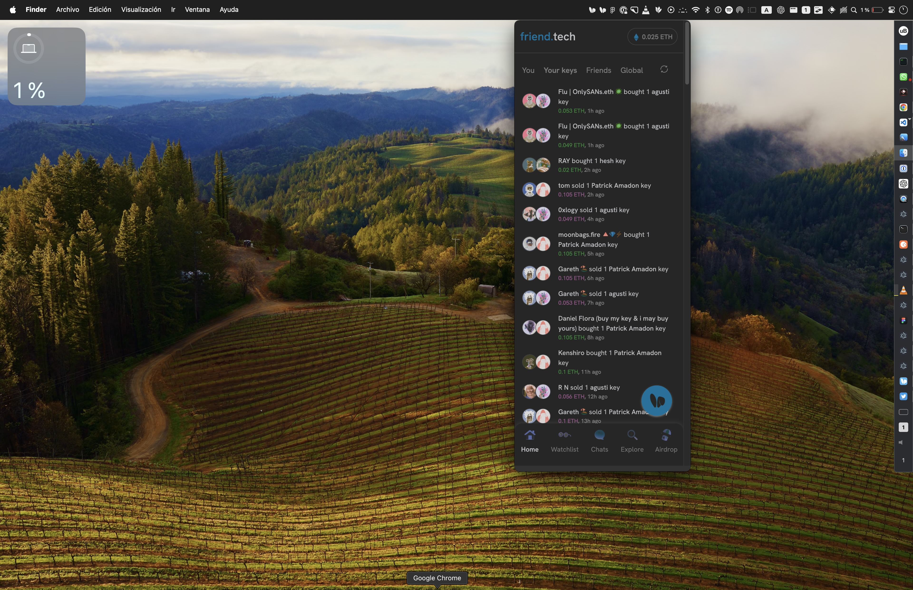

# Friend.Tech for your Menubar

A menubar app for Friend.Tech.

<p align="center">
  
</p>

You can use Cmd+Shift+Y (Mac) or Ctrl+Shift+Y (Win) to quickly open it from anywhere.

## Shortcuts
| Action | Shortcut (Mac) | Shortcut (Win) |
| ------ | -------------- | -------------- |
| Go to Home | Cmd+Shift+H | Ctrl+Shift+H |
| Go to Chats | Cmd+Shift+C | Ctrl+Shift+C |
| Go to Watchlist | Cmd+Shift+W | Ctrl+Shift+W |
| Go to Explore/Search | Cmd+Shift+S | Ctrl+Shift+S |
| Go to Airdrop | Cmd+Shift+A | Ctrl+Shift+A |
| Go to Account Settings | Cmd+Shift+. | Ctrl+Shift+. |


## Download:

- [Mac Arm64 .dmg](https://github.com/agustif/friendtech-menubar-app/releases/download/v0.0.1/FriendTech-0.0.1-arm64.dmg)
- [Mac Intel .dmg](https://github.com/agustif/friendtech-menubar-app/releases/download/v0.0.1/FriendTech-0.0.1-x64.dmg)

No Windows binaries currently offered. Clone the repo, npm install electron-forge and run.

## Usage

To run the app, simply download the latest release from the [releases page](https://github.com/agustif/friendtech-menubar-app/releases) and double-click the executable file.

## Development

To develop the app, you'll need to have Node.js and npm or yarn installed. Then, follow these steps:

1. Clone the repository: `git clone https://github.com/agustif/friendtech-menubar-app.git`
2. Install dependencies: `npm install` or `yarn install`
3. Start the app: `npm start` or `yarn start`

This will launch the app in development mode, with hot-reloading enabled.

## Packaging

To package the app as a binary, you can use the `package` script:

```bash
npm run package
```
This will create a packaged app in the out directory.

You can also use the make script to create distributable installers for different platforms:

```bash
npm run make
```

This will create installers for macOS, Windows, and Linux in the out/make directory.


## Author

This app was built by Agusti Fernandez,
You can find me on Twitter [@0xAgusti](https://twitter.com/0xAgusti).
and in my FT room [Friend.Tech/0xAgusti](https://friend.tech/0xAgusti).

### Donate

If you're a happy user of the project and would like to donate to the author, you can do so sending whatever you want to my crypto wallet:

ENS: `agust.eth`

EVM Wallet: `0xf5e9a212c15aa67a7658048f59ec3e88bc9c0ea2`


## Credits

All credit and copyrights goes to Friend.Tech and it's creators and owners.

This app merely acts as a nice UX/UI wrapper to fit the friend.tech webapp into a webview that shows in your menubar.

### Prior art

This repo for building a menubar app for friend.tech, has been inspired on Vincent's prior work on his awesome chatgpt-mac app which I've used a lot since he released.

Please do give him a follow on twitter [@vincelwt](https://twitter.com/vincelwt).

### OS X Notarization

This app is currently not notarised, so you will probably have to explicitly open it from the privacy and security settings in your mac the first time you run it.

We might offer notarised binaries in the future.

## Versions

- alpha initial release (2/10/2023)
